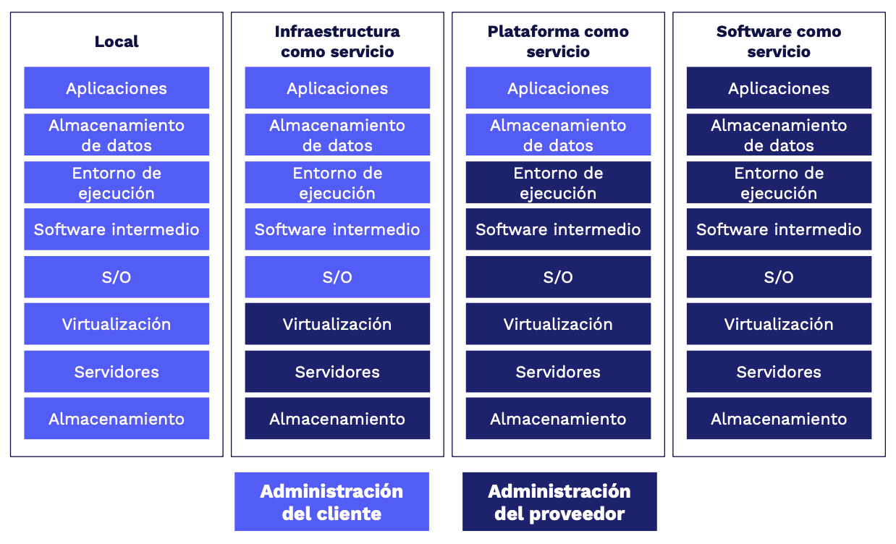

## Introducción a la Nube con Azure

 1. Aprender sobre la nube

### **Conociendo Azure**
- Qué es
- Azure Portal
- Marketplace
- Servicios

### **Servicios:**

- Cómputo
- Web
- Almacenamiento
- BBDD
- Red
- IA
- DevOps
- Entornos
- Serverless
- IoT
- Seguridad

### **Componentes de Azure**

- Suscripciones
- Grupos de administración
- Recursos
- Grupos de recursos
- Regiones

### **Seguridad y privacidad**

- Protección de la información.
- Red segura.
- Servicios de identidad.
- Gobernanza de la nube.
- Estándares de privacidad.

### **Acuerdo de nivel de servicio**

- Acuerdos.
- Ciclo de vida del servicio.
- Administración de costos de servicio.

### Certificaciones Microsoft

**Developer:** Diseñan, construyen, prueban y mantienen soluciones para la nube:

- Azure Developer
- Developer Associate
- Dynamics 365
- Power Platform Developer
- IoT Developer

**Solutions Architect:** Expertos en cómputo, redes, almacenamiento y seguridad:

- Azure Solutions
- Power Platform
- Finance and Operations Apps

**DevOps Engineer:** Combinan personas, procesos y tecnologías para entregar productos de valor y servicios de forma continua:

- Azure DevOps Engineer Expert

**Security Engineer:** Implementan controles de seguridad y protección de amenazas para accesos, datos, aplicaciones y redes: 

- Azure Security Engineer
- Security Operations
- Indentity and Access

**Administrator:** Implementan, monitorean y mantienen soluciones.

- Azure Administrator
- Windows Virtual Desktop
- Teams Administrator
- Security Administrator

**Data Engineer:** Diseñan e implementan la administración, monitoreo, seguridad y privacidad de datos 

- Azure Data Engineer Associate

**Data Scientist:** Aplican técnicas de machine learning para entrenar, evaluar y desplegar modelos que resuelven problemas de negocio:

- Azure Data Scientist Associate

**AI Engineer:** Usan servicios cognitivos, machine learning y knowledge mining para diseñar e implementar soluciones:

- Azure AI Engineer Associate.

 2. ¿Qué es la nube? Ventajas y características

### ¿Qué es la nube?

La nube son instalaciones en las cuales cada una tiene de forma independiente energia electrica, refrigeración y seguridad, son llamados Centro de Datos. Dentro de ellos se encuentran cientos de equipos conectados a Internet para consumir los servicios ofrecidos en la Nube.

Los Centros de Datos se encuentran distribuidos a lo largo del mundo. Azure es el servicio Cloud que tiene mas DataCenters desplegados a nivel mundial.

<aside>
💡 Azure (Microsoft) busca que sus DataCenters sean 100% sustentables utilizando Energias Limpias

</aside>

### ¿Para qué o Por qué?

- Cómputo
- Servidores
- Almacenamiento y bases de datos
- Redes
- Inteligencia Artificial
- Software y mas

> "Todo lo que puedes hacer en una computadora se puede hacer en la nube pero más: **barato, ágil y seguro**"
> 

### Modelo basado en consumo

Pago por servicios usados:

- Reduce costos operativos
- Optimiza la infraestructura
- Escala según las necesidades

### CapEx vs OpEx

- **Gastos de capital (CapEx):** Inversión en infraestructura física, deducible a largo plazo
- **Gastos operativos (OpEx):** Inversión en servicios o productos facturados al momento

### Ventajas

**Confiabilidad y Alta Disponibilidad**

- Experiencia de usuario sin tiempo de inactividad perceptible, aunque haya errores

**Escalable**

- Vertical: aumentando RAM | CPU a una VM
- Horizontal: aumentado instancias de recursos

**Elasticidad**

- Las aplicaciones siempre tendrán los recursos necesarios

**Agilidad**

- Instanciar recursos en la nube es muy rápido de implementar y configurar

**Distribución geográfica**

- DataCenter en todo el mundo ofreciendo el mejor rendimiento a cada región

**Recuperación ante desastres**

- Los datos se protegen con copias de seguridad, replicación de datos y distribución geográfica

 3. Modelos de servicio: IaaS, PaaS, SaaS y serverless

### On-Premise (Local)

Todo corre por tu cuente:

- Equipos
- Adecuación
- Mantenimiento
- Configuración
- Actualización

### IaaS

**Ventajas**

Parecido a on-premise ofreciendo mayor flexibilidad y control sobre el hardware:

- Sin CapEx
- Ágil
- Administración compartida

**Desventajas**

- Complicado al inicio según el grado de detalle que se requiere en aspectos de conocimiento y tiempo

### PaaS

**Ventajas**

Entorno administrado por el proveedor: VMs, red, infraestructura.

- Solo te preocupas por el desarrollo.
- Configuración más ágil que IaaS.
- Enfocado al despliegue de aplicaciones.

**Desventajas**

- Puede ser más caro que IaaS.
- Compatibilidad con algunos elementos.
- Dependencias con el proveedor.
- Riesgos de seguridad.
- Limitantes de idioma, interfaz o recursos.

### SaaS

**Ventajas**

El proveedor administra el 100% del entorno y los usuarios solo utilizan la aplicación que se ejecuta en la nube:

- Office Online.
- Outlook.
- CRM.
- ERP.

**Desventajas**

- Se necesita conexión a internet.
- Poco control.
- Baja personalización.
- Desempeño limitado.

### Serveless

- Sí usa servidores.
- El proveedor aprovisiona, escala y administra la infraestructura.
- Ejecuta funciones o fracciones de código.
- Es dirigida por eventos.

**Ventajas**

- Altamente escalable.
- Enfocada a la lógica de negocio.
- Ahorro de tiempo.
- Desarrollo ágil.
- Pago por uso.

**Desventajas**

- No están diseñada para procesos extensos.
- Detalles de desempeño.
- Retos de testing y debugging.

 4. Tipos de nube: pública, privada e híbrida

### Nube Pública

- Accesible a todo el mundo.
- Son propiedad de un proveedor.
- Se distribuye a través de internet.

### Nube Privada

- Accesible para miembros de una organización
- Puede estar on-premise u hospedada.

### Nube Híbrida

- Combinación de on-premise, nube pública y privada.

## Componentes de Azure

 5. ¿Qué es Azure?

Es un proveedor de servicios en la nube, cuenta con mas de 100 servicios distintos para ser accedidos a través de internet. Cubre prácticamente cualquier necesidad para la nube o de computo.

### Ventajas de Azure

- Preparado para el futuro.
- Crea a tu ritmo.
- Listo para cualquier tipo de nube.
- Confiable.
- Cuenta con plataforma Microsoft Learn -

[Examinar todo - Learn](https://docs.microsoft.com/es-es/learn/browse/?products=azure&amp%3Bresource_type=learning%20path)

### ¿Cómo funciona Azure?

- A través de la virtualización (se puede realizar de forma local o en la nube en un Datacenter).
- Basado en virtualización abstrae los elementos de una PC recibidos por un Hypervisor.
- Se usa un orquestador encargado de recibir nuestras indicaciones.

### Herramientas

- Azure Portal - [https://portal.azure.com/](https://portal.azure.com/)
- Azure MarketPlace

 6. Cuentas de Azure

**Recursos:** Instancias de los servicios disponibles como máquinas virtuales, discos duros y bases de datos.

**Grupos de recursos:** Contenedor lógico donde se implementan y administran recursos de Azure. Un recurso puede pertenecer a un solo GR pero puede comunicarse con recursos de otro GR.

**Suscripciones:** Agrupación de cuentas de usuario y recursos creados por estas cuentas. Puede tener límites o cuotas definidas.

**Grupos de administración:** Administran el acceso, las directivas y cumplimiento de las suscripciones. Las suscripciones heredan las condiciones de su grupo.

Creación de la Cuenta

[Soluciones de Azure | Microsoft Azure](https://azure.microsoft.com/es-es/solutions/)

 7. Suscripciones y grupos de administración

Se necesita de una suscripción de Azure para utilizar sus servicios:

- Desarrollador: pagas por los servicios a medida que los utilices.
- Prueba: experimentar de manera gratuita.
- Suscripción: a través de un partner compras servicios de Azure.
- Estudiante: a través de un email autorizado (.edu)

### Limites

1. **Facturación:** forma de facturarse. Cada suscripción tiene su factura.
2. **Control de acceso:** cada suscripción tiene directivas de acceso.

### ¿Cuándo se necesita más suscripciones?

- **Entorno:** separación de entornos de trabajos como desarrollo, pruebas, aislamiento de datos, entre otros.
- **Estructura Organizacional:** limitaciones según presupuesto, tiempo, por equipos o acceso a recursos.
- **Facturación:** para facilitar el seguimiento de costos según entornos como producción, desarrollo o pruebas.
- **Límites por suscripción:** Pueden haber algunas limitaciones de hardware por suscripción, entonces es necesario crear nuevas.

### Grupos de Administración

**Consideraciones:**

- Hasta 10 000 grupos de administración en un único directorio.
- El árbol de grupo de administración puede admitir hasta seis niveles de profundidad.
- Cada grupo de administración y suscripción solo puede admitir un elemento primario.
- Cada grupo de administración puede tener muchos elementos secundarios.
- Todas las suscripciones y grupos de administración están dentro de una única jerarquía en cada directorio.

 8. Recursos y grupo de recursos

**Recurso:** elemento administrable en Azure.

**Grupo de recursos:** contenedor de recursos relacionados a una solución.

### Características

- Todos los recursos deben estar en un grupo.
- Un recurso solo puede pertenecer a un grupo.

<aside>
💡 Cuando eliminas un grupo de recursos, también elimina todos los recursos contenidos.

</aside>

### Autorización

Utilizan permisos de control basado en roles (**RBAC - Roles Based Access Control**), permitiendo acceso solo a lo necesario.

### Herramientas

**Azure Resource Manager**

- Plantillas en JSON.
- Administrar recursos por grupo.
- Capacidad de reutilización.
- RBAC.
- Etiquetas.
- Facturación.

 9. Regiones

Área geográfica con por lo menos un data center. Algunos servicios son exclusivos de ciertas regiones.

- Canada East
- North Europe
- South Africa North

**Regiones Especiales**

- US DoD
- US Gov Virginia
- US Gov Iowa
- China East
- China North

<aside>
💡 Azure es el proveedor con más regiones globales y en constante expansión.

</aside>

[https://docs.microsoft.com/en-us/learn/modules/azure-architecture-fundamentals/regions-availability-zones](https://docs.microsoft.com/en-us/learn/modules/azure-architecture-fundamentals/regions-availability-zones)

### Zonas de disponibilidad

- Distintos data centers en una misma región equipados con energía de emergencia, refrigeración y redes independientes.

**Propósito**

- Permiten redudancia de servicios y datos ante errores, desastres u otros imprevistos.

**Consideraciones**

- No todas las regiones son compatibles con zonas de disponiblidad.
- Esto puede implicar un costo.

### Pares de regiones

Regiones con por lo menos 500 km de distancia entre ambas para replicar recursos en caso de interrupciones, como:

- Desastres naturales.
- Incendios.
- Disturbios civiles.
- Ausencia de electricidad.
- Daños en la red física.
- Otros.

 10. Laboratorio: crear un sitio en WordPress

# Labs

[Ejercicio: Creación de un sitio web hospedado en Azure - Learn](https://docs.microsoft.com/es-mx/learn/modules/azure-architecture-fundamentals/exercise-create-website)

[https://docs.google.com/document/d/1nT6lvqlRPhlPCy1a-Xknp-aPwBjm5gKHqk5QW2CLj6s/edit](https://docs.google.com/document/d/1nT6lvqlRPhlPCy1a-Xknp-aPwBjm5gKHqk5QW2CLj6s/edit)

## Servicios de Azure

 11. Análisis y bases de datos

### **Tipos de bases de datos:**

- Estructuradas (SQL)
- No Estructuradas (NoSQL)

### **Tipos de Datos**

- Estructurados
- Semi-estructurados
- No estructarados

### Servicios

1. **Azure Cosmo DB**
- Servicio de bases de datos NoSQL, elástico e independiente al rendimiento y almacenamiento de las regiones.
- Almacena datos en formato de secuencia de registro de átomos (ARS).
- Se abstraen los datos y se proyectan como una API.
- Compatibilidad con SQL, Gremlin, Cassandra, MondoDB
2. **Azure SQL Database**
- Basado en Microsoft SQL Server.
- Alto rendimiento
- Confiable
- Administrada
- Segura
- Compatible con NoSQL
- Funciona como PaaS controlando las funciones administrativas de una BD:
- Actualizaciones
- Revisiones
- Backups
- Supervisión
3. **Azure SQL Managed Instance**
- Comando para backup.
- Common language runtime (CLR).

> **CLR:** Es el entorno de ejecución de código .NET en SQL que se encarga de compilar y convertir el código pára que sea ejecutado en la CPU de la máquina.
> 
- Transacciones entre bases de datos.
- No cuenta con escalado automático.

### Servicios para motores específicos

1. **Azure Database for MySQL**
- Basado en MySQL Community Edition 5.6, 5.7 y 8.0.
- Alta disponibilidad.
- Escalado en segundos.
- Protección de información.
- Backups automáticos.
2. **Azure Database for PostgreSQL**
- Basado en PostgreSQL.
- Opción de servidor único:
- Básico
- Uso general
- Optimizado
- Hiperscala (Citus) para cargas de
100 GB o más.

### Servicios de análisis y big data

1. **Azure Synapse Analytics**
- Análisis de datos de todo tipo: sin procesar, refinados o seleccionados.
- Por medio de recursos sin servidor o provisionados.
- Compatible con SQL y Apache Spark.
2. **Azure HDInsight**
- Análisis de datos de open source.
- Procesa grandes volúmenes de datos.
- Puede crear clusters de tipo Spark, Hadoop, Kafka, HBase y más.
- Admite ETLs.
3. **Azure Databricks**
- Descubre información de volúmenes masivos de datos.
- Compatible con Apache Spark.
- Funciona Python, Scala, R, Java, SQL, TensorFlow, PyTorch y Scikit-Learn.
4. **Azure Data Lake Analytics**
- Realiza análisis bajo demanda.
- Enfocado a ETL en lugar de configurar hardware.
- Modelo pay as you go.

# Labs

[Ejercicio: Creación de una base de datos SQL - Learn](https://docs.microsoft.com/es-es/learn/modules/azure-database-fundamentals/exercise-create-sql-database)

 12. Servicios de cómputo en la nube

### Azure Virtual Machines

- IaaS
- Conveniente para:
- Pruebas y desarrollo.
- Ejecutar aplicaciones en la nube.
- Extender recursos en la nube.
- Recuperación ante desastres.
- Migración (lift-and-shift)
- Azure Batch:
- Conjuntos de VMs.
- Configuración en minutos de máquinas idénticas.
- Aumento o disminución automático.

### Azure Container Instances

- PaaS para ejecución de contenedores
- Sencillo
- Sin servicios adicionales
- Permite carga de contenedores

### Azure Kubernetes Service

- Orquestación (automatización y administración) de contenedores en volumen.
- Utilidad de contenedores:
- Dividir las partes de una aplicación.
- Hacer cambios sin afectar otras partes.
- Hacer pruebas en entornos aislados

### Azure App Service

- PaaS para crear y alojar aplicaciones conectadas a la web.
- Compatible con Windows, Linux e implementaciones automatizadas.
- Tipos de servicios:
- Aplicaciones web.
- Aplicaciones de API.
- Operaciones en segundo plano.
- Aplicaciones móviles.

### Azure Functions (serverless)

- Funciones que responden a eventos:
- Peticiones REST.
- Temporizador.
- Mensajes de otro servicio.
- Escalan automáticamente.
- Sin estado.
- Con estado (Durable Functions).

### Azure Logic Apps (serverless)

- Flujos de trabajo basados en eventos.
- Cuenta con una GUI.
- Se crean de forma visual o en JSON.
- Cuenta con más de 200 conectores y bloques.

### Windows Virtual Desktop

- Tener Windows en cualquier lugar.
- Compatible con los sistemas operativos mas populares o incluso navegadores web.
- Ventajas:
- Compatibilidad.
- Mejor experiencia de uso.
- Seguridad.
- Rendimiento.
- Inicio de sesión múltiple.
- Licencias propias.

# Labs

[Ejercicio: Creación de una máquina virtual Windows - Learn](https://docs.microsoft.com/es-es/learn/modules/create-windows-virtual-machine-in-azure/3-exercise-create-a-vm)

[Ejercicio: Conexión a una máquina virtual Windows mediante RDP - Learn](https://docs.microsoft.com/es-es/learn/modules/create-windows-virtual-machine-in-azure/5-exercise-connect-to-a-windows-vm-using-rdp)

 13. Almacenamiento

### Azure Blob Storage

- Almacenamiento no estructurado.
- Sin restricciones.
- Soporta miles de cargas simultáneas.
- Ideal para:
- Visualizar imágenes o videos.
- Acceso distribuido.
- Streaming.
- Backup.
- Análisis de datos.
- Almacenamiento de VMs >8 TB.

### Azure Files

- Recursos compartidos administrados en la nube bajo protocolos SMB y NFS.
- Pueden estar en local o en la nube.
- Ideal para:
- Cuando muchas aplicaciones usan recursos compartidos.
- Acceder a recursos desde varias VMs.
- Similar a OneDrive.

### Niveles de acceso:

1. **Frecuente:** Imágenes o descargas de un sitio web.
2. **Esporádico (30 días):** Reportes mensuales, facturas, etc.
3. **Archivo (180 días):** Copias de seguridad.

# Labs

[Ejercicio: creación de una cuenta de almacenamiento mediante Azure Portal - Learn](https://docs.microsoft.com/es-es/learn/modules/create-azure-storage-account/5-exercise-create-a-storage-account)

 14. Red

### Azure Virtual Network

- Permite a los recursos de Azure comunicarse entre sí, con usuarios de internet y equipos cliente en local.
- Funcionalidades:
- Aislamiento y segmentación
- Comunicación con internet
- Comunicación entre recursos
- Redes virtuales.
- Puntos de conexión de servicio.
- Comunicación entre recursos locales
- Redes virtuales de punto a sitio.
- Redes privadas virtuales (VPN) de sitio a sitio.
- Azure ExpressRoute.
- Enrutamiento del tráfico de red
- Tablas de ruta.
- Protocolo de puerta de enlace de borde (BGP).
- Filtrado del tráfico de red
- Grupos de seguridad de red.
- Aplicaciones virtuales de red.

### Azure VPN Gateway

- Conecta redes locales a Azure vía VPN de sitio a sitio/punto, a sitio, a través de protocolos IPsec e IKE.

### Azure ExpressRoute

- Genera conexiones privadas entre Azure y la infraestructura, de forma confiable y rápida, sin utilizar internet público.

# Labs

[Ejercicio: creación de una red virtual de Azure - Learn](https://docs.microsoft.com/es-es/learn/modules/configure-network-for-azure-virtual-machines/3-exercise-create-azure-virtual-network)

[Ejercicio: Creación de una instancia de Azure VPN Gateway - Learn](https://docs.microsoft.com/es-es/learn/modules/configure-network-for-azure-virtual-machines/5-exercise-create-azure-vpn-gateway)

 15. Inteligencia Artificial

1. **Deep Learning:** usa redes neuronales para descubrir, aprender y crecer.
2. **Machine learning:** utiliza datos existentes para entrenar modelos y pronosticar.

### Azure Machine Learning

- PaaS para realizar predicciones conectándose a datos para entrenar y probar modelos.
- Ofrece control completo del diseño y entrenamiento de algoritmos.

### Azure Cognitive Services

- Modelos de ML creados que permiten a una aplicación ver, oír, hablar, entender y pensar. No se necesitan conocimientos en ML o DS.
- Categorías:
- Lengua
- Voz
- Visión
- Decisión

### Azure Bot Service

- Azure Bot Service.
- Bot Framework.
- Creación de agentes virtuales que pueden usar otros servicios.

# Labs

[Ejercicio: análisis de imágenes con el servicio Computer Vision - Learn](https://docs.microsoft.com/es-es/learn/modules/analyze-images-computer-vision/3-analyze-images)

 16. DevOps

# **Azure DevOps Services**

## Azure Repos

- Repositorios de código fuente centralizado para publicar código y colaborar.

## Azure Boards

- Tableros para gestión de proyectos como Kanban, informes, incidencias, epics, etc.

## Azure Pipelines

- Herramienta de automatización de:
- Continuos Integration
- Continuos Delivery

## Azure Artifacts

- Repositorio para alojar *artefactos* que se incluyen en el flujo de pruebas o implementación.

## Azure Test Plans

- Herramientas de pruebas automatizadas para garantizar la calidad antes de lanzar software.

# GitHub & GitHub Actions

- **Git:** herramienta de control de versiones.
- **GitHub:** repositorio de código remoto.

## GitHub Actions

- Automatización de flujos de trabajo basado en triggers, especialmente para CI/CD.

# Azure DevTest Labs

- Medio automatizado para administrar proceso de compilación, configuración y anulación de VMs y otros recursos.

# Labs

[Ejercicio: Creación de una prueba de rendimiento para una aplicación web mediante Azure Portal - Learn](https://docs.microsoft.com/es-es/learn/modules/load-test-web-app-azure-devops/3-create-a-quick-performance-test-for-a-web-app-using-the-azure-portal)

[Ejercicio: Uso de Azure DevOps para personalizar y volver a configurar las pruebas de carga de aplicaciones web - Learn](https://docs.microsoft.com/es-es/learn/modules/load-test-web-app-azure-devops/6-use-azure-devops-to-customize-and-reconfigure-web-app-load-tests)

 17. Monitoreo y supervisión

## Azure Advisor

- Evalúa recursos, brinda recomendaciones y notificaciones de mejora a través de Azure Portal y su API.
- Categorías:
- Confiabilidad.
- Seguridad.
- Rendimiento.
- Costos.
- Excelencia operativa.

## Azure Monitor

- Plataforma que recopila, analiza y muestra datos para tomar acciones basada en métricas del entorno local y Azure.

## Azure Service Health

- Brinda vista personalizada del estado de los servicios, regiones y recursos de Azure.
- Eventos:
- Problemas de servicio.
- Mantenimientos planeados.
- Avisos de estado.

## Azure Network Security Group

- Filtrar el tráfico de red hacia y desde los recursos de Azure en una red virtual de Azure.
- Un grupo de seguridad de red contiene [reglas de seguridad](https://docs.microsoft.com/en-us/azure/virtual-network/security-overview#security-rules) que permiten o deniegan el tráfico de red entrante hacia, o el tráfico de red saliente desde, varios tipos de recursos de Azure.
- Para cada regla, se puede especificar **el origen y el destino, el puerto y el protocolo**. [Este artículo](https://docs.microsoft.com/en-us/azure/virtual-network/security-overview) describe las propiedades de una regla de grupo de seguridad de red, las [reglas de seguridad predeterminadas](https://docs.microsoft.com/en-us/azure/virtual-network/security-overview#default-security-rules) que se aplican y las propiedades de la regla que puede modificar para crear una [regla de seguridad aumentada](https://docs.microsoft.com/en-us/azure/virtual-network/security-overview#augmented-security-rules).

# Labs

[Ejercicio: Configuración de una máquina virtual con diagnósticos de arranque - Learn](https://docs.microsoft.com/es-es/learn/modules/monitor-azure-vm-using-diagnostic-data/3-exercise-create-virtual-machine)

[Ejercicio: Configuración de la extensión Azure Diagnostics - Learn](https://docs.microsoft.com/es-es/learn/modules/monitor-azure-vm-using-diagnostic-data/6-exercise-configure-azure-diagnostic-extension)

 18. Admistración y Configuración de entorno

### Azure Portal

### Azure Mobile App

- Compatible con iOS y Android.
- Supervisa estado de Azure.
- Alertas, diagnósticos y correcciones.
- Ejecutar comandos de CLI o Azure PowerShell.

### Azure PowerShell

### Azure CLI

### Cloud Shell

### Azure Resource Manager Templates

- Formato JSON.
- Se comprueban antes de ejecutarse.
- Se define el estado y configuración de cada recurso, la plantilla hace el resto.

### Labs

[Ejercicio: Creación de una aplicación de funciones en Azure Portal - Learn](https://docs.microsoft.com/es-es/learn/modules/create-serverless-logic-with-azure-functions/3-create-an-azure-functions-app-in-the-azure-portal?pivots=javascript)

[Ejercicio: Incorporación de lógica a la aplicación de funciones - Learn](https://docs.microsoft.com/es-es/learn/modules/create-serverless-logic-with-azure-functions/5-add-logic-to-the-function-app?pivots=javascript)

 19. Serveless

## Azure Functions

- Alojamiento de métodos o funciones que se ejecutan enrespuesta a eventos:
- Solicitudes HTTP
- Temporizadores
- Mensajes
- Acciones
- Ventajas:
- Escalado automático.
- Pago por función ejecutada.
- Con o sin estado.
- Tareas de orquestación (durable functions).
- Lenguajes compatibles
- C#
- JavaScript
- Python
- TypeScript
- Java
- Shell

## Azure Logic Apps

- No-code/Low-code.
- Ideal par automatizar y organizar.
- Integra aplicaciones, datos y sistemas.

## Labs

[Ejercicio: Incorporación de lógica a la aplicación de funciones - Learn](https://docs.microsoft.com/es-es/learn/modules/create-serverless-logic-with-azure-functions/5-add-logic-to-the-function-app?pivots=javascript)

[Ejercicio: Creación de una rama en función de las opiniones del tweet - Learn](https://docs.microsoft.com/es-es/learn/modules/route-and-process-data-logic-apps/8-ex-branch-based-on-tweet-sentiment)

[Ejercicio: Creación de una aplicación de funciones en Azure Portal - Learn](https://docs.microsoft.com/es-es/learn/modules/create-serverless-logic-with-azure-functions/3-create-an-azure-functions-app-in-the-azure-portal?pivots=javascript)

[Ejercicio: Creación de la aplicación lógica de seguimiento de redes sociales - Learn](https://docs.microsoft.com/es-es/learn/modules/route-and-process-data-logic-apps/4-ex-create-social-media-tracker)

 20. IoT

> El Internet of Things (IoT), describe la red de objetos físicos (cosas), que llevan sensores integrados, software y otras tecnologías, con el fin de conectar e intercambiar datos con otros dispositivos y sistemas a través de Internet.
> 

### ¿De dónde vienen los datos?

**Sensores**:

- Temperatura.
- Humedad.
- Códigos (barras, QR).
- Proximidad.
- Ubicación geográfica.
- Sonido.
- Movimiento.
- Biométricos.

## Azure IoT Hub

- Centro de mensajes entre aplicaciones IoT y dispositivos.
- Permite control remoto manual o automatizado de dispositivos.
- Cuenta con supervisión

## Azure IoT Central

- Basado en IoT Hub con interfaz visual.
- Posee plantillas para escenarios comunes.

## Azure Sphere

- Avnet Azure Sphere MT3620 Starter Kit
- Seeed MT3620 Mini Dev Board
- Kit de desarrollo de Seeed Azure Sphere MT3620
- Partes:
- Unidad de Microcontrolador (MCU).
- Sistema operativo (SO).
- Servicio de seguridad (AS3).
- Requisitos:
- Kit de desarrollo.
- **Windows**
- Visual Studio.
- Visual Studio Code.
- Línea de comandos con CMake.
- **Linux**
- Visual Studio Code.
- Línea de comandos con CMake.

## Labs

[Ejercicio: Creación de un servicio de aprovisionamiento de dispositivos, un certificado raíz y una inscripción de grupo - Learn](https://docs.microsoft.com/es-es/learn/modules/securely-provision-iot-devices-at-scale-with-device-provisioning-service/4-exercise-create-dps-resource-root-certificate-group-enrollment)

[Ejercicio: Creación del código para los dispositivos de sensor - Learn](https://docs.microsoft.com/es-es/learn/modules/securely-provision-iot-devices-at-scale-with-device-provisioning-service/6-exercise-create-code-sensor-devices?pivots=vscode)

[Ejercicio: Comprobación de que varios dispositivos se aprovisionan automáticamente y se asignan al centro - Learn](https://docs.microsoft.com/es-es/learn/modules/securely-provision-iot-devices-at-scale-with-device-provisioning-service/7-exercise-test-multiple-devices-provision-correctly)

  21. Seguridad

## Servicios de Seguridad

## Azure Security Center

- Servicio que brinda visibilidad del nivel de seguridad de los servicios en Azure y local.
- Supervisa la configuración de seguridad.
- Aplica cambios automáticamente.
- Brinda recomendaciones.
- Detecta y bloquea amenazas de malware con ML.
- Detecta ataques e investiga amenazas.
- Proporciona control de acceso *Just-in-Time.*

### Puntuación de seguridad

Es la medida del nivel de seguridad y permite:

- Notificar el estado actual.
- Mejorar el nivel.
- Compara puntos de referencia.

## Azure Sentinel

- SIEM en la nube de análisis de seguridad y amenazas.
- Recopila datos en volumen.
- Detecta amenazas
- Investiga con IA.
- Responde a incidentes.

## Azure Key Vault

- Servicio centralizado para almacenar datos confidenciales.
- **Administra**:
- Secretos.
- Claves de cifrado.
- Certificados SSL/TLS.
- Respaldos por módulos de seguridad de hardware (HMS).

## Azure Dedicated Host

- Servidores físicos que no se comparten con otros inquilinos y/o aplicaciones.
- Ofrece visibilidad y control.
- Asegura requisitos de cumplimiento.
- Personalizable.
- Puede tener mayor costo.

# Servicios de Seguridad de Red

## Azure Firewall

## Azure DDoS Protection

# Servicios de Identidad

- **Autenticación (AuthN):** Solicitar credenciales legítimas.
- **Autorización (AuthZ):** Establecer el nivel de acceso a una persona o servicio autenticado.

Un buen sistema de autenticación se compone de 3 elementos claves:

- Algo que sabes
- Algo que tienes
- Algo que eres

## Azure Active Directory

## Multi-Factor Authentication

## Inicio de Sesión Único (SSO)

# Labs

[Ejercicio: Administración de una contraseña en Azure Key Vault - Learn](https://docs.microsoft.com/es-es/learn/modules/protect-against-security-threats-azure/5-manage-password-key-vault)

[Ejercicio: agregar o eliminar usuarios en Azure Active Directory - Learn](https://docs.microsoft.com/es-es/learn/modules/create-users-and-groups-in-azure-active-directory/3-exercise-add-delete-users-azure-ad)

[Ejercicio: asignar usuarios a grupos de Azure Active Directory - Learn](https://docs.microsoft.com/es-es/learn/modules/create-users-and-groups-in-azure-active-directory/5-exercise-assign-users-azure-ad-groups)

[Ejercicio: Habilitación de Azure AD Multi-Factor Authentication - Learn](https://docs.microsoft.com/es-es/learn/modules/secure-aad-users-with-mfa/4-exercise-mfa)

## Protección de Datos

 22. Privacidad, cumplimiento y protección de datos

<aside>
💡 Los datos de nuestros clientes NO son nuestros datos.
</aside>

# ¿Cumplimiento?

Cumplir con una ley, estándar, conjunto de directrices, normas o requerimientos.

- Globales
- Gubernamentales
- Sectoriales
- Regionales

## Declaración de privacidad

- Explica qué datos personales recopila Microsoft, cómo los usa y para qué.
- Abarca todos sus servicios, sitios, software, servidores y dispositivos.

## Términos de los servicios en línea

- Contrato legal entre Microsoft y el cliente.
- Detalla las obligaciones de ambas partes respecto al procesamiento y seguridad de los datos.
- ***Aplica a servicios bajo licencia.***

## Anexo de protección de datos **(Data Protection Addendum)**

- Define términos de seguridad y procesamiento de datos para servicios en línea:
- Cumplimiento de leyes
- Revelación de datos
- Seguridad de datos

# Adicional

[Información legal de Microsoft Azure | Microsoft Azure](https://azure.microsoft.com/es-mx/support/legal/)

[Confíe en su nube | Microsoft Azure](https://azure.microsoft.com/es-mx/overview/trusted-cloud/)

## Acuerdos de nivel de servicio (SLA)

 23. Administración de costos de servicio

## Calculadora de costo total de propiedad (TOC)

- Ayuda a calcular los costos de Azure vs. local.
- Deben considerarse costos indirectos, diferencias de zona, promedios, etc.

### ¿Cómo funciona?

1. Definir cargas de trabajo.
2. Ajustar supuestos.
3. Consultar informe.

## Comprar servicios

- Contratos Enterprise (B2B).
- En la web.
- Proveedor de soluciones (Microsoft partner)

### ¿Qué afecta a los costos?

- Tipo de recurso.
- Medidores de uso: tiempo, tráfico, tamaños y cantidades.
- Uso de recursos.
- Región.

## Reducción de costos

### ¿Qué afecta a los costos?

- Estimar antes de implementar.
- Azure Advisor.
- Limitar presupuestos.
- Pagar por adelantado.
- Licenciamiento.
- Disponer de regiones y ubicaciones de bajo costo.
- Investigar ofertas de ahorro.
- Azure Cost Management + Billing.
- Etiquetas para identificar costos.
- Cambiar el tamaño de recursos.
- Desasignar recursos.
- Eliminar recursos no utilizados.
- Migrar de IaaS a PaaS.

# Adicional

[Información general sobre precios - Cómo funcionan los precios de Azure | Microsoft Azure](https://azure.microsoft.com/es-mx/pricing/)

[Calculadora de precios | Microsoft Azure](https://azure.microsoft.com/es-mx/pricing/calculator/)

[Calculadora del costo total de propiedad (TCO) | Microsoft Azure](https://azure.microsoft.com/es-mx/pricing/tco/calculator/)

[Optimización de costos en la nube | Microsoft Azure](https://azure.microsoft.com/es-mx/overview/cost-optimization/)

 24. Acuerdos de nivel de servicio y ciclo de vida

# Acuerdo de nivel de servicio

- Contrato formal entre empresa de servicios y cliente.
- Define estándares de rendimiento que Microsoft se compromete a brindar.

### ¿Qué incluyen?

- Introducción.
- Términos generales.
- Detalles del SLA (Service Level Agreement).

### Importancia

**Entender**:

- Garantías de servicio.
- Hacerlas efectivas.
- Disponibilidades.

### Elementos para aumentar SLA

- Tipo de discos.
- Niveles superiores de servicio.
- Redundancia en regiones.
- Redundancia en zonas de disponibilidad.

# Cálculo del SLA compuesto

Los SLA compuestos implican varios servicios que soportan una aplicación, cada uno con diferentes niveles de disponibilidad.

Por ejemplo, considere una aplicación web de App Service que escribe en Azure SQL Database. En el momento de escribir este artículo, estos servicios de Azure tienen los siguientes acuerdos de nivel de servicio:

Aplicaciones web de App Service = 99,95%.

Base de datos SQL = 99,99%.

¿Cuál es el tiempo máximo de inactividad que se puede esperar para esta aplicación? Si cualquiera de los servicios falla, toda la aplicación falla. La probabilidad de que cada servicio falle es independiente, por lo que el SLA compuesto para esta aplicación es 99,95% × 99,99% = 99,94%. Esto es más bajo que los SLA individuales, lo que no es sorprendente porque una aplicación que depende de varios servicios tiene más puntos potenciales de fallo.

Se puede mejorar el SLA compuesto creando rutas independientes de reserva. Por ejemplo, si la base de datos SQL no está disponible, ponga las transacciones en una cola para ser procesadas más tarde.

## Ciclo de vida

- Forma en que cada servicio está disponible.
- **Fases**:
- Desarrollo.
- Preliminar.
- Disponibilidad general (GA).
- Desaconsejado.

## Azure Policy

ayuda a aplicar las normas de la organización y a evaluar el cumplimiento a escala. A través de su panel de control de cumplimiento, proporciona una vista agregada para evaluar el estado general del entorno, con la capacidad de desglosar la granularidad por recurso y por política. También ayuda a que sus recursos cumplan con la normativa mediante la corrección masiva de los recursos existentes y la corrección automática de los nuevos recursos.

Los casos de uso comunes para Azure Policy incluyen la implementación de la gobernanza para la coherencia de los recursos, el cumplimiento de las normativas, la seguridad, los costes y la gestión. Las definiciones de políticas para estos casos de uso comunes ya están disponibles en su entorno de Azure como elementos incorporados para ayudarle a empezar.

## Adicional

[Contratos de nivel de servicio - Página principal | Microsoft Azure](https://azure.microsoft.com/es-mx/support/legal/sla/)

## Bonus

 AZ-900 Fundamentals

## Azure Cloud Computing

## Azure Architectural Components

## Azure Compute Services

## Azure Container Services

## Azure Network Services

## Azure Storage Services

## Azure Database Services

 Glosario

---

1. **Cloud computing:** Descompone las funciones clave de un ordenador y las ofrece como un servicio (como el procesamiento, el almacenamiento o la conexión en red). Es un tipo de informática basada en Internet que proporciona recursos de procesamiento informático y datos compartidos a ordenadores a otros dispositivos bajo demanda.
2. **Scaling:** Utilización de más recursos en la nube de los previstos o anticipados.
3. **Vertical Scaling:** - Adición de recursos adicionales para hacer frente a una mayor carga de trabajo para aumentar 2 núcleos de CPU a 4 en un servidor satisfacer la petición del usuario o un aumento de la RAM de 4 GB a 8 GB.
4. **Horizontal Scaling:** Aumentar la capacidad de su infraestructura en la nube, por ejemplo en el caso de que un servidor traiga otra instancia de una capacidad similar y luego equilibrar la carga entre los dos.
5. **Manual Scaling:** Es por lo que la supervisión se realiza físicamente y se escala según sea necesario.Automatic Scaling - Es por lo que un programa o un script realiza el escalado en base a parámetros que se le dan.
6. **Elastic:** Significa que los recursos de la nube pueden aumentar o disminuir en función de la demanda de los usuarios.
7. **Up to date:** Significa que la nube aprovecha el hardware más reciente, ya que los proveedores proveen que para el hardware y el software.
8. **Reliable:** Los proveedores de la nube tienen una infraestructura de centros de datos distribuidos por todo el mundo que a través de la cual replican los datos del cliente haciendo que se diga que es fiable debido a las múltiples copias y backups de los datos del cliente.
9. **Global:** La infraestructura de nube distribuida en todo el mundo del proveedor la hace global.
10. **Secure:** Las medidas físicas con políticas y controles establecidos, junto con personal experimentado personal experimentado hace que la nube sea segura, pero no exime a los clientes de su responsabilidad de mantener la seguridad de los datos.
11. **Shared security model:** Un marco de funcionamiento de la nube que describe la responsabilidad de los proveedores de la nube como de los clientes en el mantenimiento de la seguridad de la nube.
12. **Economies of scale:** Los proveedores de la nube se benefician de la existencia de muchos centros de datos, hardware y servidores, alcanzan una cierta eficiencia en la ejecución de tareas repetidas en comparación con proveedores muchos proveedores más pequeños, junto con costes unitarios y una menor fiscalidad debido a la compra a gran escala de servicios.
13. **Compliance:** La adhesión del proveedor de la nube a las normas y reglamentos establecidos establecido por las partes interesadas del sector y la normativa.
14. **Cloud security alliance star certification:** Cloud Security Alliance es una organización sin ánimo de lucro organización sin ánimo de lucro con la misión de "promover el uso de las mejores prácticas para proporcionar garantía de seguridad dentro de la computación en nube, y proporcionar educación sobre los usos de la computación en nube para ayudar a asegurar todas otras formas de computación. Han establecido un marco de certificación con tres niveles de garantía.
15. **CCM - Cloud Control Mix:** Estándar de cumplimiento de la alianza de seguridad de 4 estrellas.
16. **NIST - National Institute of Standard Technology:** Tiene un marco voluntario que consiste en normas, directrices y mejores prácticas para gestionar los riesgos relacionados con la ciberseguridad.
17. **AIPCA SOC - Service Organisations Controls:** Una norma de certificación de cumplimiento de servicios específica del sector.
18. **HIPAA - Health Insurance Portability and Accountability:** Ley de los Estados Unidos de América para los pacientes que regula la información sanitaria regulada del paciente.
19. **PCI DSS - Payment Card Industry Data Security Service:** Una norma de seguridad propia para organizaciones que manejan tarjetas de marca, por ejemplo, Visa, MasterCard, JCB, etc.
20. **Criminal Justice Information Systems:** Es una política de seguridad en los Estados Unidos de América (USA) para el gobierno, los estados y las autoridades locales que rigen el acceso a la información penal y de justicia información, así como de la Oficina Federal de Investigaciones (FBI).
21. **GPDR - General Data Protection Regulation:** Un reglamento de la Unión Europea (UE) que rige a todo aquel que recoja datos de información personal dentro de la UE. Entró en vigor el 28 de mayo de 2018.
22. **UK government GCloud:** Una normativa del Reino Unido que regula mediante la certificación de los productos y servicios en la nube utilizados por el gobierno del Reino Unido.
23. **MDA - Media Development Authority:** Es un gobierno de Singapur de varios niveles de seguridad en la nube de Singapur.
24. **Capex - Capital Expenditure:** Es un coste inicial con valor que se reduce con el tiempo. Es la Es la configuración inicial de una infraestructura de tecnología de la información. Por lo general, cubre los servidores, el almacenamiento, la red, las copias de seguridad, la continuidad del negocio, la instalación de centros de datos y el personal técnico, almacenamiento, red, copias de seguridad, continuidad del negocio, instalación de centros de datos y costes de personal técnico.
25. **Opex - Operational expenditure:** Es el gasto en el que se incurre cada mes en el que se consume servicios o productos, por ejemplo, los diferentes arrendamientos como el de la nube pueden incluir infraestructura, software, cargos por escalamiento de recursos, facturación por usuario entre otros.
26. **Auto-scaling consumption model:** Modelo de funcionamiento basado en la nube que permite el escalado ascendente o escalado ascendente o descendente de los recursos de la nube en función de la demanda. La infraestructura se pone en marcha cuando se necesita, pero se apaga cuando no se necesita; por lo tanto, no hay recursos no utilizados.
27. **Cloud deployment model:** Define dónde se almacenan los datos y dónde se ejecutan las aplicaciones. se ejecutan las aplicaciones.
- **Private cloud:** Es un modelo de despliegue que almacena sus datos en sus propias instalaciones.
- **Public cloud:** Es un modelo de implementación que almacena sus datos en una infraestructura gestionada por un proveedor de nubes como Microsoft Azure.
- **Hybrid cloud:** Es un modelo de implementación que almacena sus datos tanto en las instalaciones y en la nube con comunicación entre ambos.
28. **Cloud service model:** Diferentes formas de alojamiento en la nube infraestructura.
29. **On premise model:** En el que uno es responsable de la compra, instalación y administración de su centro de datos.
30. **Iaas:** Infraestructura como servicio - en el que un proveedor de la nube es responsable de gestionar el hardware (red, almacenamiento, servidores) para el cliente, que tiene la libertad de elegir su sistema operativo y el resto de la pila de servicios pagados.
31. **Virtualization:** La virtualización es una tecnología que representa el hardware subyacente como software.
32. **Hypervisor:** Una característica del sistema operativo moderno que puede representar las señales del hardware físico como equivalente de software que puede ser utilizado en máquinas virtuales que se inician en el host.
33. **Fabric controller:** Este software es responsable de la gestión de los servidores en el rack.
34. **Orchestrator:** Un software centralizado que controla todos los controladores de tejido en un centro de datos.
35. **Services:** Variedad de usos que proporciona la nube de Microsoft Azure.
36. **Geographies:** Un mercado discreto con dos o más regiones que preserva la residencia y límites de cumplimiento.
37. **Region pair:** Dos regiones que están a 300 millas de distancia la una de la otra y que se ponen a trabajar juntas en MS Azure.
38. **Redundancy:** Un modelo de arquitectura que milita contra un único punto de fallo en su composición.
39. **Availability zones:** Centros de datos físicos separados dentro de una zona Azure.
40. **Service Level Agreement (SLA):** Es un documento formal que especifica el compromiso de Microsoft compromiso de Microsoft para operar el servicio, define los estándares de rendimiento y describe lo que que ocurrirá si el servicio no cumple con los estándares especificados.
41. **Uptime:** Es el periodo de tiempo determinado en el que un servicio en la nube concreto o determinado está disponible.
42. **Resiliency:** Capacidad de un sistema para recuperarse de un fallo. Sus componentes son:
- **Availability:** Es similar al tiempo de actividad y es la naturaleza de un servicio en la nube particular o determinado accesibilidad.
- **High availability:** Es una implementación de medidas para prevenir fallos para la accesibilidad de un recurso o servicio alojado en la nube.
43. **Disaster recovery:** Modalidad de restablecimiento de los servicios en caso de que no estén disponibles debido a por cualquier circunstancia imprevista.
44. **Account:** Una cuenta en la nube de Microsoft Azure puede ser personal o propiedad de una organización.
45. **Azure account:** Asociada a una identidad como su correo electrónico, pero también tiene sus otros datos como nombre, datos de contacto y datos de pago.
46. **AAD- Azure Active Directory:** Es un proveedor de identidad basado en la nube que soporta múltiples protocolos de autenticación (como OpenID y OAuth).
47. **Azure billing:** Cobro por el uso de los recursos de Azure.
48. **Subscription:** Una agrupación lógica para varios propósitos. Por lo general, se incluyen en las siguientes categorías:
- **Free:** Para servicios que no conllevan ningún gasto.
- **PAYG - Pay As You Go:** Se trata de una suscripción de pago regular para servicios a precio de venta al público.
- **Enterprise Agreement:** Esta suscripción ofrece la opción de comprar servicios en la nube ylicencias de software bajo el mismo acuerdo.
- **CSP – Cloud Service Provider:** La suscripción CSP se puede comprar asocios autorizados de Microsoft.
- **Multiple:** Combinación de los planes de suscripción anteriores, así como otros que pueden ser únicos desde una perspectiva de caso a caso basada en los servicios y productos anteriores que el cliente puede haber adquirido de Microsoft.
49. **AAD - Azure Active Directory:** Azure Active Directory es un proveedor de identidad basado en la nube que soporta múltiples protocolos de autenticación que incluyen estándares modernos como Open ID y OAuth.
50. **Billing:** Cargos cobrados por los servicios de Azure.
51. **Support:** Ayuda técnica extendida a los clientes para los problemas que surgen en la nube de Azure de Azure.
- **Free support:** Soporte técnico proporcionado a los clientes en Azure sin ningún cargo.
- **Paid support:** Se proporciona a los clientes que necesitan un soporte técnico más profundo.
52. **Azure Knowledge Centre:** Es una base de datos en la que se pueden realizar búsquedas con soluciones a problemas comunes. problemas.
53. **Azure documentation:** Se encuentra en el sitio web de Azure con detalles en profundidad sobre Azure como tutoriales, API’s y SDL’s entre muchos más.
54. **Azure portal:** Interfaz de usuario basada en la web que se puede cargar con cualquier navegador.
55. **Beta feature:** Un pre-lanzamiento de una característica de software en la nube de Azure que se entrega a un gran grupo de usuarios para que la prueben en condiciones reales. Las características de un producto o un servicio liberado al público para una vista previa.
- **Private features:** Se liberan a un conjunto selecto de clientes para su evaluación, normalmente clientes estratégicos y personas con información privilegiada de Azure que participan activamente en el envío de comentarios.
56. **Beta service:** Un pre-lanzamiento de un servicio de software en la nube de Azure que se entrega a un gran grupo de usuarios para que lo prueben en condiciones reales.
57. **Azure power shell:** Es un módulo que puede instalar power shell para Windows, o Linux o Mac. Este módulo añade líneas de comando adicionales a power shell que le permiten gestionar los recursos de Azure recursos.
58. **Azure CLI:** Es una herramienta de línea de comandos multiplataforma que puede utilizar para crear y gestionar recursos en Azure. Al estar basada en Python se puede ejecutar en cualquier sistema operativo que tenga Python.
59. **OS - Operating System:** Un sistema operativo es un software de sistema que gestiona los recursos de hardware y software del ordenador y proporciona servicios comunes. recursos de hardware y software y proporciona servicios comunes para los programas informáticos.
60. **Command Line Interface (CLI):** Una interfaz de línea de comandos es un medio para interactuar con un programa informático en el que el usuario emite comandos al programa en forma de líneas de texto sucesivas. líneas de texto. El programa que maneja la interfaz se llama intérprete de línea de comandos o procesador de línea de comandos, o shell.
61. **Azure Cloud Shell:** Es una potente interfaz de línea de comandos que puede ejecutar dentro de su navegador. Se puede acceder a ella a través del portal de Azure y se puede elegir entre la línea de comandos de Azure Azure o el comando Power Shell. Ambos están disponibles en la nube de Azure.
62. **Azure Mobile App:** Le permite gestionar los recursos de Azure cuando está en movimiento.
63. **Azure dashboards:** Son mosaicos de interfaz de usuario personalizables que se pueden mostrar en el portal.
64. **Service Level Agreement (SLA):** Un contrato entre un proveedor y un cliente que especifica qué servicios se prestarán, las responsabilidades de cada parte y cualquier garantía de servicio.
65. **Third-Party Integration:** Combinar los sistemas y datos de una organización con entidades externas.
66. **General availability:** Es la etapa en la que una característica probada se incorpora a Azure como una característica estándar.
67. **Compute:** La capacidad de Azure Compute le da acceso programático a máquinas virtuales y sus recursos de apoyo.
68. **VM - Virtual Machine:** Proporciona una emulación por software de la computación física. Tienen un procesador procesador, memoria, disco duro, interfaz de red y necesitan un sistema operativo.
69. **Azure Virtual Machine:** Es un servicio que permite crear máquinas virtuales en la nube. Es el que ofrece más control.
70. **Availability sets:** Es una agrupación lógica de dos o más máquinas virtuales que le ayuda a mantener su aplicación disponible en caso de mantenimiento planificado y no planificado.
71. **RDP – Remote Desktop:** Es un cliente de software de conexión remota de Microsoft.
72. **SSH - Secure Shell:** Un cliente de software de conexión remota de Linux.
73. **Serverless:** Ofrece una ejecución en la nube de su código con completa abstracción de la infraestructura subyacente. Puedes desplegar tu código personalizado y ejecutarlo basado en disparadores de eventos. Se ejecuta en varios lenguajes, pero tienes menos control con serverless que también se conoce como sin estado.
74. **Fault domains:** En Azure, se trata de un único rack de servidores que tiene energía, refrigeración y hardware físico que proporcionan una separación física de las cargas de trabajo.
75. **Update domains:** Representa un grupo de máquinas virtuales que pueden reiniciarse al mismo al mismo tiempo. Son importantes durante el mantenimiento planificado cuando hay que reiniciar una máquina virtual.
76. **Lift and shift:** Es la introducción de una(s) imagen(es) personalizada(s) pre-creada(s) de máquina(s) virtual(es) en el entorno de producción.
77. **Load balancer:** El equilibrador de carga soporta escenarios de entrada y salida, proporciona baja latencia y alto rendimiento, y escala hasta millones de flujos para todas las aplicaciones TCP y UDP.
- **Azure Load Balancer:** Equilibra el tráfico entre máquinas virtuales. Con Azure Load Balancer, puede escalar sus aplicaciones y crear alta disponibilidad para sus servicios.
- **Round robin:** Modo de trabajo de balanceo de carga que asigna una nueva carga al siguiente balanceador disponible hasta que se agotan todos los balanceadores, momento en el que se reanuda la asignación de una carga al primer balanceador original. equilibrador original.
78. **Virtual Machine scale sets:** Servicio que permite gestionar un grupo de servidores idénticos. un servicio que permite gestionar un grupo de servidores idénticos, por ejemplo, una granja web que ejecuta servidores apache en paralelo sirviendo las peticiones de los usuarios.
79. **Container:** Similar a las máquinas virtuales, los contenedores se asientan sobre un sistema operativo anfitrión, pero no requieren su propio sistema operativo instalado dentro del contenedor. Si necesita Si necesita conseguir el mismo aislamiento que con las máquinas virtuales, pero quiere aumentar la eficiencia de su infraestructura, puede utilizar contenedores.
80. **Banner:** Mensaje que el servicio transmite cuando otro programa se conecta a él.
81. **Banner grabbing:** Cuando el programa se utiliza para recoger intencionalmente esta información. Esto puede ser hecho usando Telnet para crear una conexión con el host y luego consultar cada puerto.
82. **Microservice architecture:** Se trata de un servicio que tiene un ámbito de aplicación pequeño y bien definido y que está débilmente acoplado a cualquier otro servicio. En lugar de construir una gran aplicación monolítica, se construyen muchos servicios pequeños que cumplen cada uno una única función de negocio. Luego se pegan esos servicios juntos y proporcionan la lógica de negocio de su aplicación.
83. **Kubernetes:** Una solución de orquestación de contenedores.
84. **Docker:** Un motor de orquestación de contenedores.
85. **ACS - Azure Container Services:** Soporta contenedores Docker para Linux y Windows.
86. **ACI - Azure Container instance:** Es una plataforma como servicio (Paas) que permite ejecutar un contenedor sin necesidad de gestionar máquinas virtuales en el motor Docker.
87. **AKS - Azure Kubernetes Service:** Azure Kubernetes Services es un servicio completo de orquestación para contenedores que puede ser escalado a cientos o miles de nodos.
88. **App service plan:** Determina cuánto se paga por los recursos, así como la forma en que se dedican los recursos a su anfitrión web con una opción de recursos dedicados o compartidos.
89. **Azure functions:** Un servicio de Azure que utiliza la computación sin servidor. Utiliza un enfoque de código primero o de desarrollo imperativo, lo que significa que usted escribe un código personalizado que se ejecuta en la nube. Se pueden utilizar lenguajes de programación como C#, F#, JavaScript, Java, Python, Type Script.
90. **Serverless:** Se implementa cuando los proveedores de la nube utilizan un grupo de servidores para implementar su código y el servidor utilizado aquí es mantenido y elegido por el proveedor de la nube. No hay garantía de que la próxima vez que su código se ejecute será en el servidor.
91. **Stateful function:** Función duradera y que pasa el contexto entre las ejecuciones y permite seguir la actividad anterior. Las funciones con estado también se llaman funciones duraderas y pasan el contexto entre ejecuciones permitiéndote rastrear el parámetro.
92. **Azure Logic Apps:** Es otra implementación sin servidor en la nube de Azure que utiliza el enfoque del diseñador primero o declarativo. Se construyen cargas de trabajo usando conectores pre-construidos y bloques de procesamiento que son más de doscientos como servicios sociales, office 365, Dynamics 365, Zen desk, JIRA, Salesforce, SAP, Facebook y más. Son stateful y pueden persistir la información entre ejecuciones.
93. **Structured data:** Se ajustan a un esquema predefinido y se almacenan en tablas con filas y columnas. También se conocen como datos relacionales.
94. **JSON- JavaScript Object Notation:** Es un formato de archivo de estándar abierto que utiliza texto legible para transmitir objetos de datos que consisten en pares de atributos y valores y tipos de datos de matriz. texto para transmitir objetos de datos que consisten en pares de atributos-valores y tipos de datos de matriz.
95. **Unstructured data:** Pueden ser cualquier cosa y no hay restricciones de formato. La estructura puede ser un PDF, un documento de Word, un vídeo, una imagen o cualquier blob binario. A menudo se pueden adjuntar metadatos a los datos no estructurados para clasificarlos.
96. **Big data:** Gartner lo define como un alto volumen, alta velocidad y alta variedad que exigen un procesamiento de la información innovador y rentable que permita mejorar los conocimientos, la toma de decisiones y la automatización de los procesos.
97. **Azure SQL database:** Es una base de datos relacional como servicio (daas) basada en la última versión del motor de base de datos Microsoft SQL.
98. **Azure Cosmos database:** Es un daas sin esquema distribuido globalmente. Es una base de datos multimodelo que admite diferentes interfaces de programación de aplicaciones (API) para el acceso, incluyendo: Casandra, Mongo, Gremlin, Table y SQL. Lo que significa que puede migrar los datos de aquellos con capacidad de lectura/escritura.
99. **Azure blob storage:** Es un almacenamiento no estructurado altamente escalable que puede utilizarse para almacenar cualquier tipo de datos. Se puede acceder a los blobs a través de cualquier punto final HTTP/S desde cualquier parte del mundo.
100. **Azure data lake storage:** Es un tipo de almacenamiento de objetos que incluye un conjunto de capacidades dedicadas a la analítica de big data. Se basa en el almacenamiento blob de Azure con características adicionales como semántica del sistema, seguridad a nivel de directorio y archivo. Almacena datos estructurados y no estructurados y ofrece un acceso compatible con Hadoop para la analítica avanzada.
101. **Azure Queue storage:** Es un servicio de mensajería duradero y sencillo que ofrece capacidades de mensajería asíncrona. Permite construir aplicaciones flexibles y débilmente acopladas que pueden escalar de forma independiente. Ofrece acceso a puntos finales HTTP/S.
102. **Azure disk storage:** Proporciona almacenamiento en disco para la máquina virtual con opciones de unidad de disco duro (HDD) y unidad de estado sólido (SDD) y puede ser administrado o no administrado.
103. **Azure file storage:** Ofrece un recurso compartido de archivos totalmente gestionado, accesible a través del archivo Server Messaging Blob (SMB). Se puede acceder al recurso compartido desde la nube o la promesa a través de cualquier Windows, Mac o Linux.
104. **Virtual networks:** Es una red privada en la nube donde se pueden desplegar cargas de trabajo. Las redes virtuales se ejecutan en un switch para separar el tráfico de los diferentes clientes. Un ejemplo de ellas son las redes virtuales de Azure.
105. **Azure application Gateway:** Application Gateway es otra aplicación de balanceo de carga. Es puede equilibrar sólo el tráfico web.
106. **DNS – Domain Name Service:** Se utiliza para mapear nombres amistosos a los Protocolos de Internet (IP), ayudando a los usuarios a no recordar las direcciones IP numéricas.
107. **Azure Network Security group:** Un cortafuegos virtual que permite o deniega el tráfico a los recursos.
108. **VPN Gateway:** Es un tipo específico de puerta de enlace de red virtual que se utiliza para enviar tráfico cifrado tráfico entre una red virtual de Azure y una ubicación local a través de la Internet pública.
109. **Internet Gateway:** Es un “nodo” de red que conecta dos redes diferentes que utilizan diferentes protocolos (reglas) para comunicarse.
110. **Application Gateway:** También conocida como proxy de aplicación o proxy a nivel de aplicación, una aplicación es un programa de aplicación que se ejecuta en un sistema de firewall entre dos redes. Cuando un programa cliente establece
111. **Azure application gateway:** Está diseñado para el tráfico web y, por lo tanto, puede equilibrar la carga sólo con HTTP/S.
112. **Subnets:** Rango de direcciones que es una subred del espacio de direcciones de la red virtual.
- **Public cloud balancer:** Equilibrador de carga expuesto a Internet con una dirección IP pública.
- **Inbound traffic:** Tráfico enviado a su aplicación.
- **Outbound traffic:** Tráfico enviado desde su aplicación a otros sistemas.
113. **Latency/Network latency:** Tiempo necesario para que el tráfico viaje por una red y se mide en milisegundos.
114. **Throughput:** Es la velocidad de la cantidad máxima de datos que puede viajar por una red de datos y entregarse con éxito.
115. **Azure traffic manager:** Un servicio global de Azure que proporciona la funcionalidad de equilibrio de carga global.
116. **Azure CDN- Content Distribution Network:** Es un servicio de red distribuido que almacena en caché contenidos en todo el mundo. Puede estar alojado en la nube o en un proveedor de servicios de Internet (ISP) local. Suele utilizarse para almacenar en caché HTML, CSS, JS, imágenes, vídeo, multimedia o archivos de gran tamaño para su descarga que necesitan un gran ancho de banda.
117. **Physical security:** Medidas de seguridad reales adoptadas para salvaguardar un local físico y que pueden llevarse a cabo mediante guardias y vigilancia en los locales.
118. **Policies and procedures:** Para la seguridad de la nube y de la información abarca los modos y las modalidades emprendidas.
119. **Digital security:** Modalidad de seguridad de la nube y de la información y que se detiene principalmente en la autenticación de los usuarios.
120. **Paas – Platform as a service:** Es una categoría de servicios de computación en nube y es que en este modelo, el proveedor gestiona todo lo demás excepto sus aplicaciones o datos.
121. **Saas – Software as a service:** En este modelo el proveedor de la nube lo gestiona todo y usted sólo consume al software.
122. **Defence in-depth – Software as a service:** Un enfoque de seguridad por capas que es una estrategia que emplea una serie de mecanismos para frenar el avance de un ataque dirigido a adquirir acceso no autorizado a la información. Cada una de las capas de defensa implicadas proporciona protección, pero si una de ellas es vulnerada, la capa siguiente impide una mayor exposición.
123. **Azure security centre:** Un servicio de supervisión y defensa contra amenazas que proporciona protección contra amenazas para cargas de trabajo de Azure y locales.
124. **Authentication – AuthN:** El proceso de establecer la identidad de una persona o aplicación que pretende acceder a un recurso o a unos datos. La autenticación confirma que son quienes son. Es la base de la creación de un principio de seguridad que puede utilizarse para acceder al recurso.
125. **Authorization – AuthZ:** El proceso de establecer el nivel de acceso que tiene el principio. Determina a qué datos y recursos pueden acceder. Por ejemplo, un empleado puede acceder a su propia nómina mientras que un contable puede acceder a toda la nómina.
126. **Azure Active Directory:** Es un servicio de identidad basado en la nube que se puede utilizar para sincronizar la identidad o se utiliza con otros servicios empresariales de Microsoft como sMicrosoft 365 o Microsoft Dynamics.
127. **Single Sign On – SSO:** Es una tecnología que gestiona las numerosas identidades que puede tener un usuario. Esto mitiga el riesgo de que cuantas más identidades tenga que gestionar un usuario, mayor será el riesgo de incidente de seguridad relacionado con las credenciales. Con ella, los usuarios sólo recuerdan una contraseña que simplifica el modelo de seguridad.
128. **Multi – Factor Authentication:** Es una tecnología que proporciona la protección de la identidad del usuario es la Autenticación Multi-Factor. También se conoce como autenticación de dos factores, ya que requiere dos o más elementos. Por ejemplo:
- **Puede utilizar:** Algo que sabes como una contraseña o la respuesta a una pregunta de seguridad.
- **Puede utilizar:** Algo que posea como una aplicación de autenticación o un token de seguridad de la red.
- **Puede utilizar:** Algo que tienes como tu huella dactilar.
129. **Service identities:** Se mantienen en Azure eliminando la necesidad de almacenarlas en archivos de configuración, reduciendo la exposición de las credenciales.
130. **Service principle:** es una identidad de servicio a la que se le pueden asignar roles. Y sus pasos de configuración son los siguientes:
- **Identity:** Una cosa que puede ser autenticada, por ejemplo, un usuario con una contraseña o una aplicación o servidores que pueden ser autenticados con certificados y claves.
- **Principal:** Es una identidad que tiene asignadas determinadas funciones y reivindicaciones.
131. **Managed service identities – MFI:** Implica la creación de servicios e identidades y la autenticación mediante la infraestructura de Azure.
132. **Role Based Access Control – RBAC:** Los roles son conjuntos de permisos granulares para los recursos y los datos que se pueden asignar a los usuarios. Azure ha incorporado roles como el de lector o el de colaborador del administrador global, pero se pueden crear roles personalizados. Los roles se pueden conceder a nivel de usuario individual o pueden fluir hacia abajo a través de una jerarquía. Las identidades se asignan a los roles directamente o a través de un grupo
133. **Privileged identity Management – PMI:** Es una oferta de pago disponible para los clientes que les permite alcanzar la seguridad y el cumplimiento normativo en Azure.
134. **Encryption:** Es el proceso de codificar la información de forma que sólo puedan leerla las partes autorizadas. A menos que se conozca la clave de cifrado, no se puede descifrar. Es la última línea de seguridad en Azure.
- **Symmetric encryption:** Es un modo de cifrado en el que se utiliza la misma clave de cifrado para cifrar y descifrar datos. La distribución de las claves se convirtió en algo crítico, ya que ambas partes tienen que encontrar la manera de no comprometer la clave.
- **Asymmetric encryption:** Es un modo de cifrado en el que se generan dos claves de cifrado separadas pero relacionadas: una clave pública y una clave privada.
135. **Encryption in transit:** Es el proceso de codificación de la información de manera que sólo las partes autorizadas puedan leerla mientras se traslada de un punto a otro en una red.
136. **Encryption at rest:** Es el proceso de codificación de la información de manera que sólo las partes autorizadas puedan leerla mientras está almacenada en un soporte físico.
137. **Azure Storage Service Encryption – SSE:** Es una característica del almacenamiento de Azure que encripta automáticamente los datos antes de persistirlos en Azure blob, Azure disk y Azure files, entre otros…
138. **Azure Disk Encryption – ADE:** Es una función de Azure que le ayuda a cifrar sus máquinas virtuales de Windows o Linux. Aprovecha Bit locker para Windows y DM crypt para Linux. Para proporcionar cifrado para el sistema operativo y los discos de datos adjuntos a las máquinas virtuales. ADE está integrado en Azure Key Vault y utiliza Managed Service Identity (MSI) para obtener las claves para descifrar los discos.
139. **Transparent Disk Encryption – ADE:** Se utiliza para proteger la base de datos SQL y las instancias de almacén de Azure de actividades maliciosas.
140. **Azure Key Vault:** Se integra con muchos servicios en los servicios de Azure y puede utilizarse para almacenar y gestionar los secretos de las aplicaciones, eliminando la necesidad de almacenar los secretos en los archivos de configuración.
141. **Firewall:** Es un dispositivo o servicio que inspecciona el tráfico de la red y concede el acceso en función de las direcciones de protocolo de Internet (IP) de origen, el protocolo de red y el puerto. Garantiza que sólo se reenvíen las solicitudes permitidas a los recursos.
142. **Azure application gateway:** Dispone de un cortafuegos web integrado que puede proteger sus cargas de trabajo web de los ataques más comunes, como el cross site scripting y las inyecciones SQL.
143. **Network Virtual Appliance – NVA:** Son ofertas de dispositivos de terceros que están disponibles en el mercado de Azure. Son similares a los dispositivos de hardware.
144. **Distributed Denial of Service – DDoS:** Un ataque que abruma un recurso con peticiones haciendo que el recurso no esté disponible. El objetivo del atacante en el DDoS es abrumar los puntos finales enviando tantas peticiones que el recurso deja de responder.
145. **DDoS protection:** Es un servicio de Azure que protege contra los ataques DDoS.
146. **Azure Advanced Threat Protection – ATP:** Es un servicio en la nube que le ayuda a investigar las amenazas avanzadas, la actividad maliciosa de los internos y las identidades comprometidas. ATP tiene los siguientes elementos básicos:
- **ATP portal:** Supervisa y responde a las actividades sospechosas, además de gestionar e investigar las amenazas en su entorno de red.
- **ATP sensors:** Recogen los datos que se supervisan. Se instalan en su controlador de dominio controlador.
- **ATP service:** Está conectado al gráfico de seguridad de inteligencia de Microsoft y se ejecuta en la infraestructura de Azure desplegada en Europa, Estados Unidos y ASIA. Se adquiere como una licencia independiente. No está disponible para su compra en el portal de Azure.
147. **Standards:** Se generan a partir de reglamentos y normas que hay que cumplir.
148. **Azure blue print:** Es un servicio que le permite definir un conjunto repetible de recursos Azure que siguen su estándar organizativo. Por ejemplo, al utilizarlo sus equipos de desarrollo o de TI pueden asegurarse de que despliegan entornos coherentes que cumplen con sus políticas.
149. **Azure Monitor:** Es un servicio que le permite recopilar y analizar datos de telemetría de su propias instalaciones y del entorno de la nube. Las fuentes para recopilar esos datos incluyen datos de aplicaciones como: datos de rendimiento y funciones, independientemente del lenguaje y el marco en el que esté escrito, datos sobre los sistemas operativos invitados, datos sobre los recursos de Azure que está aprovechando, datos de suscripción datos relacionados con la organización o la gestión de sus suscripciones a Azure.
150. **Azure service health:** Es un conjunto de servicios que proporciona una visión general de la salud de los servicios Azure a través de las regiones.
151. **Azure pricing calculator:** Es una herramienta gratuita basada en la web que le permite seleccionar los servicios de Azure modificar diferentes opciones y obtener estimaciones de precios.

